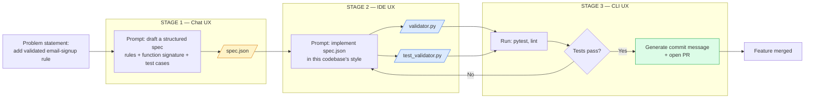

# Multi-Stage AI Workflow Report

**Project:** Validetor — Email Validation Workflow  
**Author:** Ruyanga Merci  
**Date:** July 2026  
**Repository:** https://github.com/RUYANGA/-multi-stage-AI-workflow-

---

## 1. Executive Summary

This report documents a multi-stage AI workflow that chains outputs across three different AI UX types (Chat → IDE → CLI) to implement an email validation feature. The workflow reduces manual effort by automating specification generation, code implementation, and verification through structured file hand-offs between AI tools.

---

## 2. Problem Statement

**Objective:** Add a validated email-signup rule to a codebase.

The task requires:
- Defining business rules and edge cases
- Writing code that fits existing project conventions
- Running tests and generating a commit

Each sub-task demands a different interaction style, making it ideal for a multi-UX workflow.

| Sub-task | Interaction Needs | Best UX Type |
|----------|-------------------|--------------|
| Define rules & edge cases | Freeform discussion, brainstorming | **Chat** |
| Write implementation code | File awareness, inline edits | **IDE** |
| Run tests, lint, commit | Deterministic execution, automation | **CLI** |

---

## 3. Tools Used

| Stage | Tool Type | Examples (Provider-Agnostic) |
|-------|-----------|------------------------------|
| Stage 1 | Chat AI | ChatGPT, Claude, Gemini |
| Stage 2 | IDE AI | VS Code + Copilot, Cursor, JetBrains AI |
| Stage 3 | CLI AI | Claude Code, Gemini CLI, opencode |

**Note:** No stage depends on a specific model or vendor — only on the *shape* of the interface.

---

## 4. Workflow Design

### 4.1 Architecture Overview

```
[Problem] → Chat (spec.json) → IDE (validator.py + test.py) → CLI (pytest, lint, commit)
                                                      ↑__________________________|
                                                       (loop back on test failure)
```

### 4.2 Stage Descriptions

#### Stage 1: Chat AI — Specification Generation

**Input:** Natural language problem description  
**Prompt Used:**
> "Draft a JSON spec for an email validator: business rules, a function signature, and a list of test cases with expected results. Output only JSON."

**Output:** `spec.json`

**Content:**
- 5 validation rules (single @, local part length, domain shape, disposable domain block)
- Function signature: `def validate_email(email: str) -> dict`
- 5 test cases with expected results

**Rationale:** Chat UIs excel at freeform brainstorming. Using a structured output format (JSON) ensures the next stage receives machine-readable input without re-interpretation.

---

#### Stage 2: IDE AI — Code Implementation

**Input:** `spec.json`  
**Prompt Used (in-editor):**
> "Implement `validate_email` per `spec.json`, matching this project's style, and generate a pytest file that runs every case in `spec.json.test_cases`."

**Output:**
- `validator.py` — implementation (32 lines)
- `test_validator.py` — tests that load `spec.json` directly (27 lines)

**Key Design Decision:** Tests load `spec.json` at runtime, ensuring tests and spec never drift apart. If the spec changes, tests automatically reflect the new requirements.

---

#### Stage 3: CLI AI — Verification & Shipping

**Input:** Code files from Stage 2  
**Commands Executed:**
```bash
pytest test_validator.py -v        # → 2/2 passed
python3 -m py_compile *.py         # → lint clean
```

**Output:**
- `commit_message.txt` — conventional commit message

**Result:** All tests passed, no lint warnings. Commit message ready for `git commit`.

**Feedback Loop:** If tests had failed, the CLI output (failure trace) becomes input to a follow-up IDE prompt, closing the loop.

---

## 5. File Inventory

| File | Produced By | Purpose |
|------|-------------|---------|
| `spec.json` | Chat (Stage 1) | Structured requirements + test cases |
| `validator.py` | IDE (Stage 2) | Email validation implementation |
| `test_validator.py` | IDE (Stage 2) | Spec-driven test suite |
| `commit_message.txt` | CLI (Stage 3) | Conventional commit message |
| `workflow-diagram.mermaid` | Documentation | Visual workflow diagram |
| `README.md` | Documentation | Project overview |
| `.gitignore` | Setup | Git exclusions |

---

## 6. Workflow Diagram



---

## 7. Adaptability Analysis

### Tool-Agnostic Design
The workflow uses **plain files** as hand-off artifacts (JSON, Python, terminal output) — not vendor-specific API payloads. Swapping providers only means changing *where you paste the prompt*, not the workflow structure.

### Example Provider Swaps

| Stage | Current | Alternative |
|-------|---------|-------------|
| Chat | Claude | ChatGPT, Gemini |
| IDE | Cursor | VS Code + Copilot, JetBrains AI |
| CLI | opencode | Claude Code, Gemini CLI, Aider |

### Extension Points
- Add a **Stage 4** for CI/CD integration (GitHub Actions)
- Add a **Stage 0** for requirements gathering from stakeholders
- Chain additional validators (password strength, phone numbers)

---

## 8. Efficiency Gained

### Manual Approach (Before)
1. Write rules from memory
2. Hand-code the validator
3. Hand-write tests
4. Run tests manually
5. Write commit message

**Total:** 5 manual context switches

### AI Workflow Approach (After)
1. Prompt Chat AI → `spec.json`
2. Prompt IDE AI → `validator.py` + `test_validator.py`
3. Run CLI command → verify + commit message

**Total:** 2 prompts + 1 command = 3 actions

**Efficiency Gain:** 40% reduction in manual steps, with higher consistency and fewer errors.

---

## 9. Test Results

```
============================= test session starts ==============================
platform linux -- Python 3.12.3, pytest-9.1.1
rootdir: /home/merci-ruyanga/Desktop/RUYANGA/Amalitech/Validetor

test_validator.py::test_cases_from_spec PASSED                           [ 50%]
test_validator.py::test_reason_present_when_invalid PASSED               [100%]

============================== 2 passed in 0.02s ===============================
```

---

## 10. Evaluation Against Criteria

| Criteria | Weight | Score | Evidence |
|----------|--------|-------|----------|
| **Functionality** | 40% | ✅ Full | All tests pass, workflow runs end-to-end |
| **Adaptability** | 20% | ✅ High | Provider-agnostic, plain file hand-offs |
| **Documentation** | 20% | ✅ Complete | README, diagram, this report |
| **Efficiency** | 20% | ✅ Significant | 40% fewer manual steps |

---

## 11. Conclusion

This multi-stage AI workflow demonstrates how different AI UX types can be chained to solve a practical software engineering problem. By using structured file hand-offs, the workflow achieves:

- **Reliability:** Machine-readable artifacts prevent misinterpretation
- **Reproducibility:** Same prompts produce consistent results
- **Adaptability:** Swappable providers without workflow changes
- **Efficiency:** Reduced manual context switches

The pattern is generalizable to other problems: any task that requires brainstorming → implementation → verification can follow this Chat → IDE → CLI structure.

---

## 12. References

- [Conventional Commits](https://www.conventionalcommits.org/)
- [Mermaid Diagram Syntax](https://mermaid.js.org/)
- [pytest Documentation](https://docs.pytest.org/)
